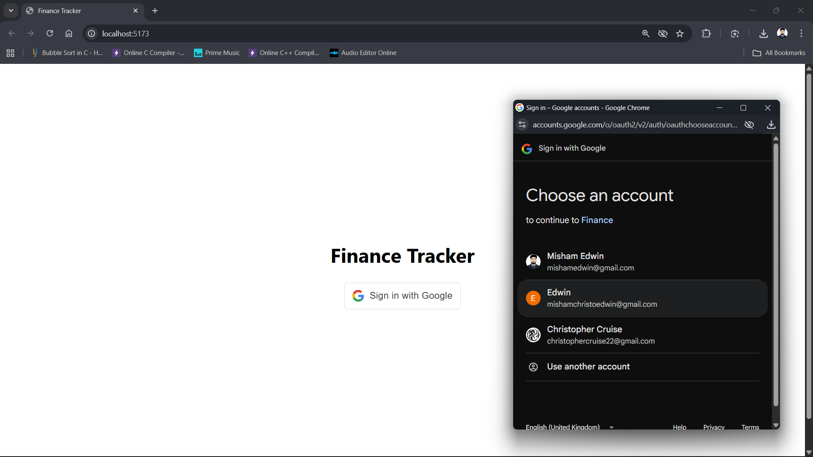
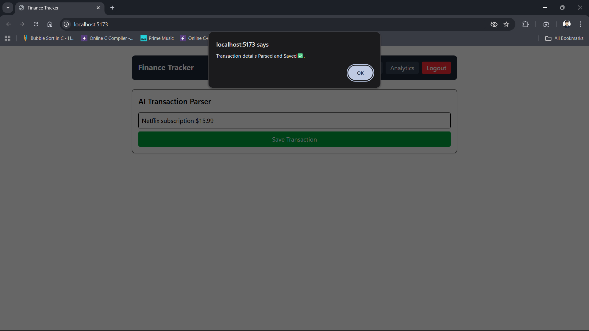
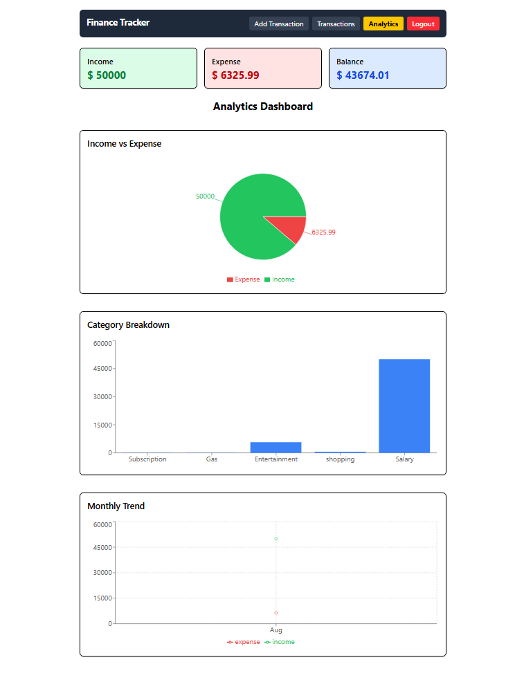
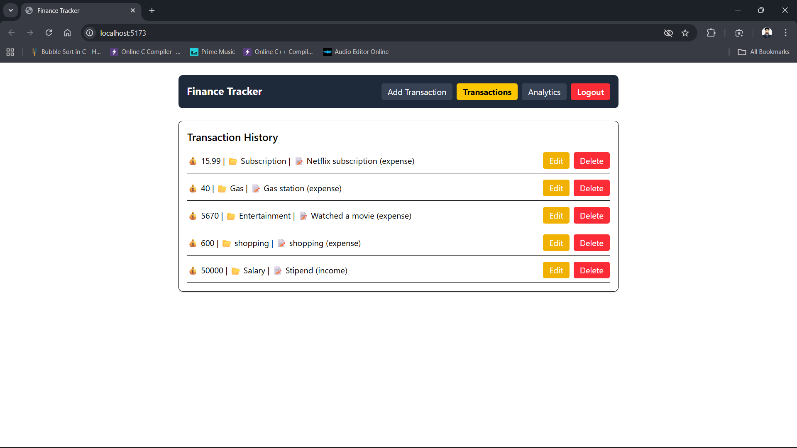

# 📊 Finance AI Tracker

A full-stack finance tracking application with **Google login,
AI-powered transaction parsing, MongoDB storage, and analytics
dashboard**.

------------------------------------------------------------------------

## 🚀 Features

-   🔑 **Google Authentication** (OAuth2 with JWT)\
-   💰 **Transaction Management** (Add, Edit, Delete, List)\
-   🤖 **AI Integration (Gemini)** → Automatically parse transaction
    descriptions\
-   📊 **Analytics Dashboard** → Income, Expense, Balance + Charts\
-   🎨 **Responsive UI** with Tailwind CSS & React\
-   ☁️ **Cloud Database** using MongoDB Atlas

------------------------------------------------------------------------

## 🛠️ Tech Stack

### Frontend

-   React (Vite)\
-   Tailwind CSS\
-   React Router\
-   Chart.js

### Backend

-   Node.js + Express\
-   MongoDB Atlas (Mongoose ORM)\
-   JWT Authentication\
-   Gemini API

------------------------------------------------------------------------

## 📂 Project Structure

    finance-ai-tracker/
    │── frontend/           # React frontend
    │   ├── src/
    │   │   ├── components/ # Navbar, Forms, Analytics, etc.
    │   │   ├── App.jsx
    │   │   ├── main.jsx
    │   │   └── index.css
    │   └── package.json
    │
    │── backend/            # Node.js backend
    │   ├── src/
    │   │   ├── routes/     # authRoutes.js, transactionRoutes.js, aiRoutes.js
    │   │   ├── models/     # Transaction.js, User.js
    │   │   └── index.js
    │   └── package.json
    │
    │── README.md

------------------------------------------------------------------------

## ⚙️ Setup Instructions

### 1. Clone the repo

``` sh
git clone https://github.com/yourusername/finance-ai-tracker.git
cd finance-ai-tracker
```

### 2. Setup Backend

``` sh
cd backend
npm install
```

Create `.env` inside `backend/`:

``` env
PORT=4000
CLIENT_URL=http://localhost:5173
MONGO_URI=your_mongodb_atlas_uri
JWT_SECRET=your_secret_key
GOOGLE_CLIENT_ID=your_google_client_id
GEMINI_API_KEY=your_gemini_api_key
```

Run the backend:

``` sh
npm run dev
```

------------------------------------------------------------------------

### 3. Setup Frontend

``` sh
cd frontend
npm install
```

Create `.env` inside `frontend/`:

``` env
VITE_BACKEND_URL=http://localhost:4000
VITE_GOOGLE_CLIENT_ID=your_google_client_id
```

Run the frontend:

``` sh
npm run dev
```

------------------------------------------------------------------------

## 🌐 Deployment

-   **Backend** → Deploy on [Render](https://render.com/) or
    [Heroku](https://heroku.com/).\
-   **Frontend** → Deploy on [Vercel](https://vercel.com/) or
    [Netlify](https://netlify.com/).\
-   Update `CLIENT_URL` in backend `.env` and `VITE_BACKEND_URL` in
    frontend `.env` with deployed links.

------------------------------------------------------------------------

## 📸 Screenshots

### 🔑 Google Login



### 🏠 Dashboard


### 📝 Add Transaction



### 📊 Analytics



### 🤖 AI Parsed Transaction



> 📌 Place your screenshots inside a folder named `screenshots/` at the
> project root.

------------------------------------------------------------------------

## 👨‍💻 Author

**Misham Christopher Edwin V**\
📧 \[mishamedwin@gmail.com\]\
🎓 MCA Graduate, Madras Christian College (2024)
